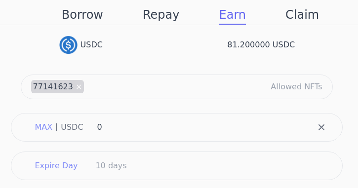
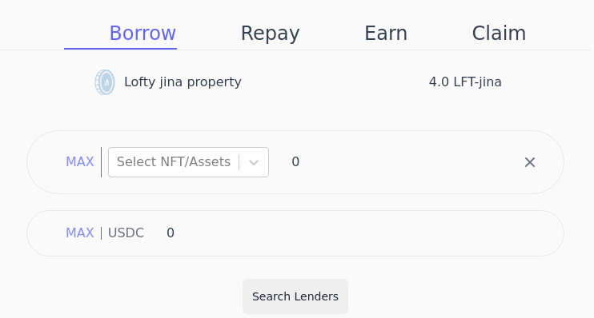
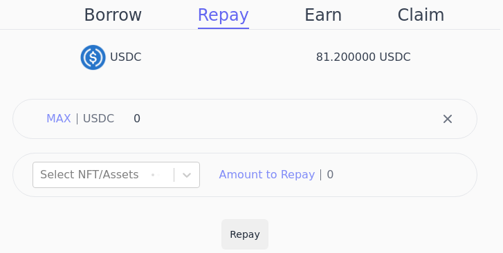
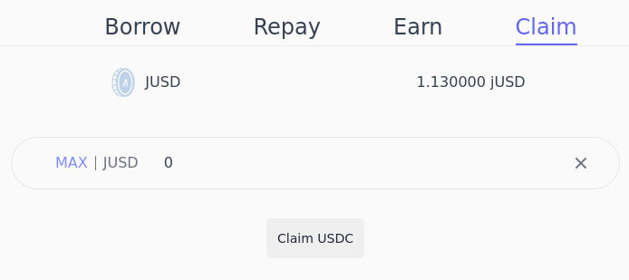
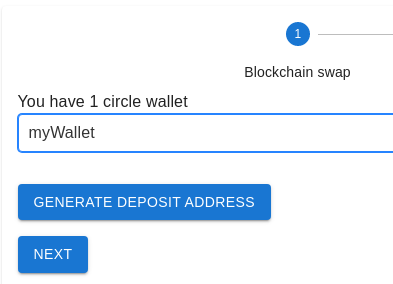
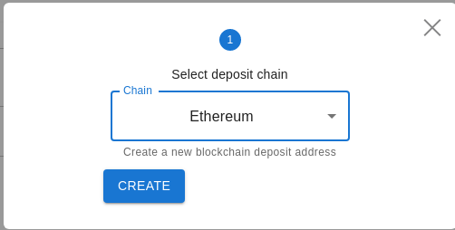
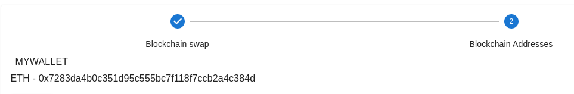

# Get started with DeFi4NFT

Watch this demo video. **Go to [live demo](https://defi4nft.vercel.app/) site.**

First step is to optin to the smartcontract.

## Optin to DeFi4NFT

### As an NFT creator

Transfer your NFT's admin address to DeFi4NFT.
This will make your NFT leverageable for taking loan in DeFi4NFT dapp.
* This sets manager and freeze admin address to DeFi4NFT smartcontract
* And sets clawback to liquidator smartcontract

### As a liquidity provider

Optin to the I-O-U token of DeFi4NFT dapp **dUSD**, that has 1:1 value with USDCa.
This happens automatically when you create a promise to provide liquidity, via the frontend.

## Earn (Providing Liquidity)

Choose which NFTs can borrow from your account.
* Set maximum amount you are willing to lend.
* Set expiration date for aggrement.

## Borrow (Leveraging NFT)

Use your NFT as collateral, to borrow USDCa stablecoin.
* Set which NFT you want to collateralize
* Set amount of collateral
* Request loan
You'll get requested loan amount in USDCa and your NFT will be locked.

## Repaying loan

Send USDCa to DeFi4NFT contract.
Your loan amount state will be decremented by sent repaid amount.

If you pay the full loan amount, your collateral assets will be unfrozen.

## Claming USDCa

Send dUSD(I-O-U token of DeFi4NFT contract) to DeFi4NFT contract.
You'll receive a 1:1 USDCa for the dUSD you send.

## Circle (Fiat-on ramp)

A fast and easy way to get fiat into our Dapp is using Circle accounts.
You can either use a credit/debit card or send USDC from other chains supported by circle.

### Swap USDC to Algorand

Powered by circle's bridge, we now offer wider options to users that want to interact in our pure non-custodial borrow/lend dapp.
You can transfer USDC from any chain supported by circle bridge to any algorand address you want to.

* First select your circle wallet linked to an algorand address.

* Then generate a blockchain address that you'll deposite USD into and get it in the Algorand address linked to that circle wallet.

* Next send USD to the generated addresses

You will recieve the deposited amount in your Algorand address soon.
For testing purposes we recommend using smaller amounts.

For more, look into Techincal review.

